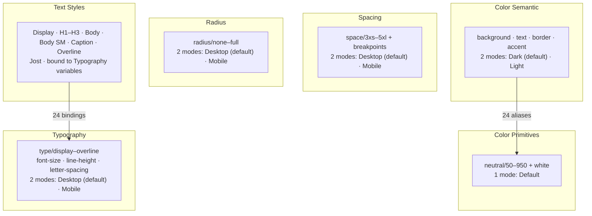

# Brak Brussels — Design Token Structure

Summary of the Figma variable architecture in [Brak-Brussels-design](https://www.figma.com/design/j4x8M8WT0aEgZ0jPk6bWcs/Brak-Brussels-design).

**Total:** 5 collections · 67 variables · 8 text styles · 24 alias connections

---

## Architecture Overview

The token system follows a **two-tier color model** plus **responsive dimension and typography tokens**:

```
Color Primitives (raw palette)
        ↓ aliases
Color Semantic (role-based, theme modes)

Typography variables ← bound by Text Styles (font family/weight set on styles)
Spacing · Radius · Typography — standalone collections with breakpoint modes
```

Spacing, Radius, and Typography are **standalone collections** with Desktop / Mobile modes — they do not alias to other collections. Text styles consume Typography variables for `fontSize`, `lineHeight`, and `letterSpacing`.



---

## Collection Connection Points

There is **one cross-collection link** in this file:

| From | To | Mechanism | Count |
|------|----|-----------|-------|
| **Color Semantic** | **Color Primitives** | Variable alias (`VARIABLE_ALIAS`) | 24 |

Every semantic color token resolves to a primitive via alias — never a hard-coded hex value. This is the primary connection point between collections.

**Spacing**, **Radius**, and **Typography** have no outgoing or incoming variable aliases. They store literal numeric values per mode.

### Text Styles → Typography variables

Text styles form a **second connection layer** — not via variable aliases, but via property bindings:

| Text Style | Font | Weight | Text case | Bound variables |
|------------|------|--------|-----------|-----------------|
| Display | Jost | Light | — | `type/display/font-size`, `line-height`, `letter-spacing` |
| H1 | Jost | Light | — | `type/h1/font-size`, `line-height`, `letter-spacing` |
| H2 | Jost | Light | — | `type/h2/font-size`, `line-height`, `letter-spacing` |
| H3 | Jost | Medium | — | `type/h3/font-size`, `line-height`, `letter-spacing` |
| Body | Jost | Regular | — | `type/body/font-size`, `line-height`, `letter-spacing` |
| Body SM | Jost | Regular | — | `type/body-sm/font-size`, `line-height`, `letter-spacing` |
| Caption | Jost | Medium | — | `type/caption/font-size`, `line-height`, `letter-spacing` |
| Overline | Jost | Medium | UPPER | `type/overline/font-size`, `line-height`, `letter-spacing` |

Font family and weight are set directly on each text style — not tokenised as variables. Only size, line-height, and letter-spacing use the Typography collection.

---

## Collections

### 1. Color Primitives

Foundation palette. Single mode, raw hex values.

| Property | Value |
|----------|-------|
| Variables | 12 |
| Mode | `Default` |
| Type | `COLOR` |
| Scopes | `ALL_SCOPES` |

| Token | Value |
|-------|-------|
| `neutral/50` | `#f7f6f5` |
| `neutral/100` | `#f0efee` |
| `neutral/200` | `#e1dfdd` |
| `neutral/300` | `#c9c6c3` |
| `neutral/400` | `#ada9a6` |
| `neutral/500` | `#8e8a87` |
| `neutral/600` | `#6f6b68` |
| `neutral/700` | `#514e4b` |
| `neutral/800` | `#353331` |
| `neutral/900` | `#242220` |
| `neutral/950` | `#191715` |
| `white` | `#ffffff` |

---

### 2. Color Semantic

Role-based tokens for UI surfaces, text, borders, and accents. Theme switching is handled via **collection modes**, not separate variable sets.

| Property | Value |
|----------|-------|
| Variables | 12 |
| Modes | `Dark` (default) · `Light` |
| Type | `COLOR` |
| Scopes | `ALL_SCOPES` |
| Aliases | All 12 variables → Color Primitives |

#### Semantic → Primitive mapping

| Semantic token | Dark mode → | Light mode → | Dark resolved | Light resolved |
|----------------|-------------|--------------|---------------|----------------|
| `background/primary` | `neutral/950` | `neutral/50` | `#191715` | `#f7f6f5` |
| `background/secondary` | `neutral/900` | `neutral/100` | `#242220` | `#f0efee` |
| `background/surface` | `neutral/800` | `white` | `#353331` | `#ffffff` |
| `background/inverted` | `neutral/100` | `neutral/800` | `#f0efee` | `#353331` |
| `text/primary` | `white` | `neutral/950` | `#ffffff` | `#191715` |
| `text/secondary` | `neutral/300` | `neutral/700` | `#c9c6c3` | `#514e4b` |
| `text/tertiary` | `neutral/500` | `neutral/500` | `#8e8a87` | `#8e8a87` |
| `text/inverted` | `neutral/900` | `neutral/100` | `#242220` | `#f0efee` |
| `border/default` | `neutral/700` | `neutral/200` | `#514e4b` | `#e1dfdd` |
| `border/subtle` | `neutral/800` | `neutral/100` | `#353331` | `#f0efee` |
| `accent/primary` | `white` | `neutral/950` | `#ffffff` | `#191715` |
| `accent/muted` | `neutral/200` | `neutral/800` | `#e1dfdd` | `#353331` |

**Theme pattern:** Dark mode inverts the neutral scale (dark backgrounds, light text). Light mode uses the lighter end of the scale for backgrounds and darker neutrals for text. `text/tertiary` is the only semantic token that maps to the same primitive in both modes. `background/inverted` and `text/inverted` are used for reversed-theme surfaces within a page (e.g. a light card on a dark background).

---

### 3. Spacing

Layout and gap tokens. Responsive values via Desktop / Mobile modes. Includes breakpoint reference values.

| Property | Value |
|----------|-------|
| Variables | 13 |
| Modes | `Desktop` (default) · `Mobile` |
| Type | `FLOAT` |
| Scopes | `WIDTH_HEIGHT`, `GAP` (space tokens) · `ALL_SCOPES` (space/3xs, breakpoints) |
| Aliases | None |

| Token | Desktop | Mobile |
|-------|---------|--------|
| `space/3xs` | 2 | 1 |
| `space/2xs` | 4 | 2 |
| `space/xs` | 8 | 4 |
| `space/sm` | 12 | 8 |
| `space/md` | 16 | 12 |
| `space/lg` | 24 | 16 |
| `space/xl` | 32 | 24 |
| `space/2xl` | 48 | 32 |
| `space/3xl` | 64 | 48 |
| `space/4xl` | 96 | 64 |
| `space/5xl` | 128 | 96 |

#### Breakpoints

| Token | Desktop | Mobile |
|-------|---------|--------|
| `breakpoints/min` | 768 | 350 |
| `breakpoints/max` | 1600 | 768 |

Breakpoints define the viewport range for each mode. Mobile spans 350–768px, Desktop spans 768–1600px.

---

### 4. Radius

Corner radius tokens. Responsive values via Desktop / Mobile modes.

| Property | Value |
|----------|-------|
| Variables | 6 |
| Modes | `Desktop` (default) · `Mobile` |
| Type | `FLOAT` |
| Scopes | `CORNER_RADIUS` |
| Aliases | None |

| Token | Desktop | Mobile |
|-------|---------|--------|
| `radius/none` | 0 | 0 |
| `radius/sm` | 2 | 2 |
| `radius/md` | 4 | 4 |
| `radius/lg` | 8 | 6 |
| `radius/xl` | 16 | 12 |
| `radius/full` | 9999 | 9999 |

Only `radius/lg` and `radius/xl` differ between breakpoints.

---

### 5. Typography

Type scale tokens for font size, line height, and letter spacing. Organised by text role, with responsive values via Desktop / Mobile modes.

| Property | Value |
|----------|-------|
| Variables | 24 |
| Modes | `Desktop` (default) · `Mobile` |
| Type | `FLOAT` |
| Scopes | `FONT_SIZE`, `LINE_HEIGHT`, `LETTER_SPACING` |
| Aliases | None |

Each text role has three variables: `type/{role}/font-size`, `type/{role}/line-height`, `type/{role}/letter-spacing`.

#### Type scale — Desktop / Mobile values

| Role | Property | Desktop | Mobile |
|------|----------|---------|--------|
| **Display** | font-size | 64 | 40 |
| | line-height | 72 | 48 |
| | letter-spacing | -1.5 | -1 |
| **H1** | font-size | 48 | 32 |
| | line-height | 56 | 40 |
| | letter-spacing | -0.5 | -0.5 |
| **H2** | font-size | 36 | 24 |
| | line-height | 44 | 32 |
| | letter-spacing | 0 | 0 |
| **H3** | font-size | 24 | 20 |
| | line-height | 32 | 28 |
| | letter-spacing | 0 | 0 |
| **Body** | font-size | 16 | 16 |
| | line-height | 20 | 20 |
| | letter-spacing | 0 | 0 |
| **Body SM** | font-size | 14 | 14 |
| | line-height | 18 | 18 |
| | letter-spacing | 0 | 0 |
| **Caption** | font-size | 12 | 12 |
| | line-height | 16 | 16 |
| | letter-spacing | 0.2 | 0.2 |
| **Overline** | font-size | 13 | 11 |
| | line-height | 16 | 14 |
| | letter-spacing | 3 | 2 |

**Responsive pattern:** Display through H3 and Overline scale down on Mobile. Body, Body SM, and Caption stay fixed across breakpoints.

#### Type ramp (Desktop)

```
Display  64/72  Light   -1.5 tracking
H1       48/56  Light   -0.5 tracking
H2       36/44  Light    0 tracking
H3       24/32  Medium   0 tracking
Body     16/20  Regular  0 tracking
Body SM  14/18  Regular  0 tracking
Caption  12/16  Medium   0.2 tracking
Overline 13/16  Medium   3 tracking · UPPERCASE
```

Format: `font-size/line-height` · weight · letter-spacing

---

## Mode Strategy

| Collection | Modes | Default | Purpose |
|------------|-------|---------|---------|
| Color Primitives | Default | Default | Static palette — no theming |
| Color Semantic | Dark, Light | **Dark** | Theme switching |
| Spacing | Desktop, Mobile | **Desktop** | Responsive layout |
| Radius | Desktop, Mobile | **Desktop** | Responsive corners |
| Typography | Desktop, Mobile | **Desktop** | Responsive type scale |

Modes are **independent per collection**. A frame can set explicit modes per collection (e.g. Light theme + Mobile spacing + Mobile typography) via Figma's mode overrides.

---

## Naming Conventions

| Pattern | Example | Used in |
|---------|---------|---------|
| `category/scale` | `neutral/500`, `space/md` | Primitives, Spacing |
| `category/role` | `background/primary`, `text/inverted` | Semantic colors |
| `category/size` | `radius/lg` | Radius |
| `type/role/property` | `type/h1/font-size` | Typography |
| Scale suffixes | `3xs`, `2xs`, `xs`, `sm`, `md`, `lg`, `xl`, `2xl`… | Spacing |
| Numeric scale | `50`, `100`…`950` | Neutral palette |
| Role names | `display`, `h1`, `body`, `caption`, `overline`… | Typography, Text Styles |

Slashes (`/`) group tokens by category. This maps cleanly to CSS custom properties: `neutral/500` → `--neutral-500`.

---

## Variable Scopes

Scopes control which Figma property pickers show each variable:

| Scope(s) | Variables |
|----------|-----------|
| `ALL_SCOPES` | All 12 primitives + all 12 semantic colors + `space/3xs` + breakpoints |
| `WIDTH_HEIGHT`, `GAP` | `space/2xs` through `space/5xl` (10 tokens) |
| `CORNER_RADIUS` | All 6 radius tokens |
| `FONT_SIZE` | 8 typography font-size tokens |
| `LINE_HEIGHT` | 8 typography line-height tokens |
| `LETTER_SPACING` | 8 typography letter-spacing tokens |

---

## Publishing & Libraries

- All 5 collections are **local** (not imported from a team library)
- 8 local text styles, all using **Jost** and bound to Typography variables
- No external library variable collections are linked
- All collections are **visible for publishing** (`hiddenFromPublishing: false`)
- No code syntax mappings (`WEB` / `ANDROID` / `iOS`) are defined on any variable yet

---

## Implementation Notes

When translating to code:

1. **Colors:** Export primitives as CSS variables first, then map semantic tokens as aliases in CSS or a theme object.
2. **Theming:** Use the Dark/Light mode split on Color Semantic — not separate variable names per theme.
3. **Responsive:** Spacing, Radius, and Typography need breakpoint-specific values (Desktop vs Mobile), separate from the color theme modes. Use `breakpoints/min` (768px) as the mobile breakpoint.
4. **Typography:** Text styles combine hard-coded font family/weight with tokenised size metrics. Export typography variables as CSS custom properties and compose text styles from them.
5. **No cross-type aliasing:** Only Color Semantic → Color Primitives uses aliases. Spacing, Radius, and Typography values are literals.

Suggested CSS structure:

```css
/* Primitives */
:root {
  --neutral-50: #f7f6f5;
  --neutral-100: #f0efee;
  --neutral-200: #e1dfdd;
  --neutral-300: #c9c6c3;
  --neutral-400: #ada9a6;
  --neutral-500: #8e8a87;
  --neutral-600: #6f6b68;
  --neutral-700: #514e4b;
  --neutral-800: #353331;
  --neutral-900: #242220;
  --neutral-950: #191715;
  --white: #ffffff;
}

/* Semantic — Dark (default) */
:root {
  --background-primary: var(--neutral-950);
  --background-secondary: var(--neutral-900);
  --background-surface: var(--neutral-800);
  --background-inverted: var(--neutral-100);
  --text-primary: var(--white);
  --text-secondary: var(--neutral-300);
  --text-tertiary: var(--neutral-500);
  --text-inverted: var(--neutral-900);
  --border-default: var(--neutral-700);
  --border-subtle: var(--neutral-800);
  --accent-primary: var(--white);
  --accent-muted: var(--neutral-200);
}

/* Semantic — Light */
[data-theme="light"] {
  --background-primary: var(--neutral-50);
  --background-secondary: var(--neutral-100);
  --background-surface: var(--white);
  --background-inverted: var(--neutral-800);
  --text-primary: var(--neutral-950);
  --text-secondary: var(--neutral-700);
  --text-tertiary: var(--neutral-500);
  --text-inverted: var(--neutral-100);
  --border-default: var(--neutral-200);
  --border-subtle: var(--neutral-100);
  --accent-primary: var(--neutral-950);
  --accent-muted: var(--neutral-800);
}

/* Spacing — Desktop (default) */
:root {
  --space-3xs: 2px;
  --space-2xs: 4px;
  --space-xs: 8px;
  --space-sm: 12px;
  --space-md: 16px;
  --space-lg: 24px;
  --space-xl: 32px;
  --space-2xl: 48px;
  --space-3xl: 64px;
  --space-4xl: 96px;
  --space-5xl: 128px;
  --breakpoint-min: 768px;
  --breakpoint-max: 1600px;
}

/* Spacing — Mobile */
@media (max-width: 768px) {
  :root {
    --space-3xs: 1px;
    --space-2xs: 2px;
    --space-xs: 4px;
    --space-sm: 8px;
    --space-md: 12px;
    --space-lg: 16px;
    --space-xl: 24px;
    --space-2xl: 32px;
    --space-3xl: 48px;
    --space-4xl: 64px;
    --space-5xl: 96px;
  }
}

/* Radius — Desktop (default) */
:root {
  --radius-none: 0;
  --radius-sm: 2px;
  --radius-md: 4px;
  --radius-lg: 8px;
  --radius-xl: 16px;
  --radius-full: 9999px;
}

/* Radius — Mobile */
@media (max-width: 768px) {
  :root {
    --radius-lg: 6px;
    --radius-xl: 12px;
  }
}

/* Typography — Desktop (default) */
:root {
  --type-display-font-size: 64px;
  --type-display-line-height: 72px;
  --type-display-letter-spacing: -1.5px;

  --type-h1-font-size: 48px;
  --type-h1-line-height: 56px;
  --type-h1-letter-spacing: -0.5px;

  --type-h2-font-size: 36px;
  --type-h2-line-height: 44px;
  --type-h2-letter-spacing: 0;

  --type-h3-font-size: 24px;
  --type-h3-line-height: 32px;
  --type-h3-letter-spacing: 0;

  --type-body-font-size: 16px;
  --type-body-line-height: 20px;
  --type-body-letter-spacing: 0;

  --type-body-sm-font-size: 14px;
  --type-body-sm-line-height: 18px;
  --type-body-sm-letter-spacing: 0;

  --type-caption-font-size: 12px;
  --type-caption-line-height: 16px;
  --type-caption-letter-spacing: 0.2px;

  --type-overline-font-size: 13px;
  --type-overline-line-height: 16px;
  --type-overline-letter-spacing: 3px;
}

/* Typography — Mobile */
@media (max-width: 768px) {
  :root {
    --type-display-font-size: 40px;
    --type-display-line-height: 48px;
    --type-display-letter-spacing: -1px;

    --type-h1-font-size: 32px;
    --type-h1-line-height: 40px;

    --type-h2-font-size: 24px;
    --type-h2-line-height: 32px;

    --type-h3-font-size: 20px;
    --type-h3-line-height: 28px;

    --type-overline-font-size: 11px;
    --type-overline-line-height: 14px;
    --type-overline-letter-spacing: 2px;
  }
}

/* Text style composition */
.text-display {
  font-family: 'Jost', sans-serif;
  font-weight: 300; /* Light */
  font-size: var(--type-display-font-size);
  line-height: var(--type-display-line-height);
  letter-spacing: var(--type-display-letter-spacing);
}

.text-h1 {
  font-family: 'Jost', sans-serif;
  font-weight: 300; /* Light */
  font-size: var(--type-h1-font-size);
  line-height: var(--type-h1-line-height);
  letter-spacing: var(--type-h1-letter-spacing);
}

.text-h2 {
  font-family: 'Jost', sans-serif;
  font-weight: 300; /* Light */
  font-size: var(--type-h2-font-size);
  line-height: var(--type-h2-line-height);
  letter-spacing: var(--type-h2-letter-spacing);
}

.text-h3 {
  font-family: 'Jost', sans-serif;
  font-weight: 500; /* Medium */
  font-size: var(--type-h3-font-size);
  line-height: var(--type-h3-line-height);
  letter-spacing: var(--type-h3-letter-spacing);
}

.text-body {
  font-family: 'Jost', sans-serif;
  font-weight: 400; /* Regular */
  font-size: var(--type-body-font-size);
  line-height: var(--type-body-line-height);
  letter-spacing: var(--type-body-letter-spacing);
}

.text-body-sm {
  font-family: 'Jost', sans-serif;
  font-weight: 400; /* Regular */
  font-size: var(--type-body-sm-font-size);
  line-height: var(--type-body-sm-line-height);
  letter-spacing: var(--type-body-sm-letter-spacing);
}

.text-caption {
  font-family: 'Jost', sans-serif;
  font-weight: 500; /* Medium */
  font-size: var(--type-caption-font-size);
  line-height: var(--type-caption-line-height);
  letter-spacing: var(--type-caption-letter-spacing);
}

.text-overline {
  font-family: 'Jost', sans-serif;
  font-weight: 500; /* Medium */
  font-size: var(--type-overline-font-size);
  line-height: var(--type-overline-line-height);
  letter-spacing: var(--type-overline-letter-spacing);
  text-transform: uppercase;
}
```
